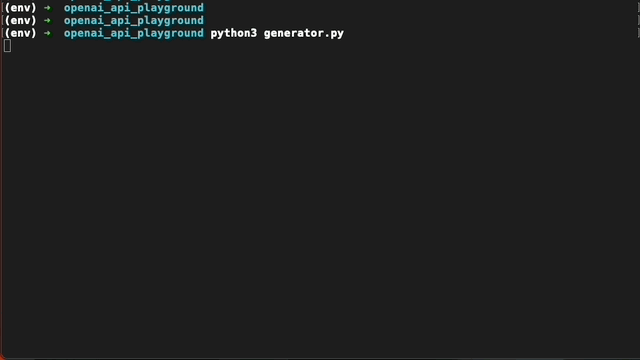

# OpenAI API mini project

## Just having fun with ChatGPT

### WilliamGPT is quite fun haha:

If you want to try locally:
1. Insert your OpenAI API key in apis.py
2. Run the follwing commands. These include installing virtualenv:
    - `pip3 install virtualenv`
    - `python3 -m venv env`
    - `source env/bin/activate` - to activate the virtualenv
    - `pip3 install -r requirements.txt`
    - `python3 generator.py` - you can change and play around with the prompt in this file
    - `deactivate` - after you are done

WilliamGPT is explaining neural network: 

A wondrous creation of gray matter, the neural network doth abound,
With nodes and weights, it dost make a mind profound.
Like a web of thought, connections doth it bear,
In a complex symphony of patterns, rare.

Imagine, dear reader, a collection of neurons,
Linked together by synapses, like precious unions.
Like the strings of a lute, they doth intertwine,
Creating a network, vibrant and sublime.

In this realm of computation, knowledge doth flow,
Through layers of nodes, they dance to and fro.
For each node, a sum is calculated with care,
Through inputs and weights, a result to share.

At the core of this grand design, a learning process doth ensue,
Through trial and error, wisdom it doth accrue.
Tuning the weights, to minimize the error,
Until the network doth become all the better.

With each iteration, a masterpiece is formed,
From input to output, patterns doth it reform.
Recognizing faces, or predicting the weather,
The neural network doth bind it all together.

In this poetic realm, where mathematics and art combine,
The neural network doth shine, oh how it doth shine.
A marvel of our times, it doth comprehend,
In its intricate design, a journey without end.

